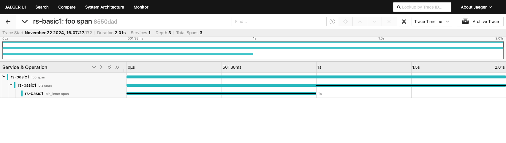

# Opentelemetry Demo

[The example](https://github.com/tokio-rs/tracing-opentelemetry/blob/v0.1.x/examples/opentelemetry-otlp.rs) provided by tracing-opentelemetry is broken. See [tracing-opentelemetry#159](https://github.com/tokio-rs/tracing-opentelemetry/issues/159)

This is a workaround. https://github.com/tokio-rs/tracing-opentelemetry/issues/159#issuecomment-2402049040

```rust
fn init_tracer() -> Tracer  {
    let provider = opentelemetry_sdk::trace::TracerProvider::builder()
    .with_config(
        opentelemetry_sdk::trace::Config::default()
        .with_resource(resource()),
    )
    // .with_simple_exporter(exporter) // stuck
    .with_batch_exporter(exporter, runtime::Tokio) // work here
    .build();

 // ...
}
```

## Run

```bash
docker run --rm -p4317:4317 -p16686:16686 jaegertracing/all-in-one:latest

RUST_LOG=DEBUG cargo run main
```

Visit http://localhost:16686 to find the traces.


